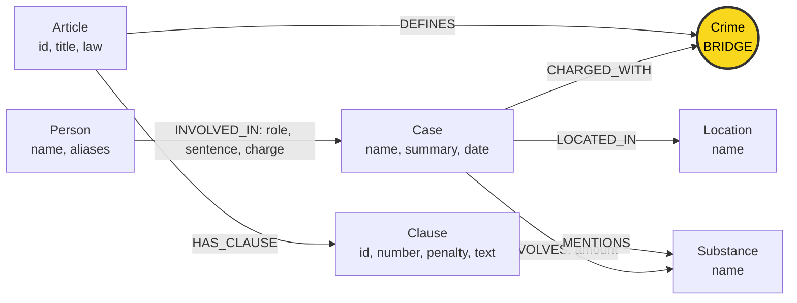

# Thiết kế Ontology — Day 19

**Họ tên:** Nguyễn Thị Lê Na  **MSSV:** 2A202602501

**Lựa chọn:** Dùng ontology gợi ý trong `src/graph.py` (các hàm `HINT`). Bản này ưu tiên khớp với ontology sẽ triển khai ở KG-2, không đăng ký xét bonus tự thiết kế.

**Dữ liệu đã đối chiếu:** `data/drug_law/blhs-dieu-251.md`; `data/drug_law/pcmt-dieu-2.md` cho định nghĩa ở Q1; các Điều 250 và 255 cho Q5/Q4; các bài tin về đường dây 36 kg (`news-100260928173914514`), Lê Minh Thành (`news-100260918080821054`), Hoàng Nato (`news-100260925144412498`), Cái Quang Huy (`news-100260917203001265`), và vụ Viện Pháp y tâm thần (`news-100260930085028036`); toàn bộ sáu câu trong `data/benchmark_kg.json`.

## 1. Sơ đồ

`Crime` là node cầu nối giữa KB tin tức và KB luật. `Article`, `Clause` thuộc KB luật; `Case`, `Person`, `Location` chủ yếu thuộc KB tin; `Crime` và `Substance` xuất hiện ở cả hai phía.

## 2. Entity types (node labels)

| Label | Ý nghĩa | Khóa định danh (`MERGE` theo) | Properties | Lấy từ KB nào | Trích bằng |
| --- | --- | --- | --- | --- | --- |
| `Article` | Một Điều luật trong corpus | `id`, ví dụ `Điều 251 BLHS` | `title`, `law`, `doc_id` | Luật | Lấy metadata `article`, `title`, `law` từ front matter của `Document` |
| `Clause` | Một khoản hoặc đơn vị được đánh số bên trong Điều | `id`, ghép từ Điều và số khoản, ví dụ `Điều 251 BLHS khoản 1` | `number`, `penalty`, `text`, `doc_id` | Luật | Regex trong `parse_law_article`; `find_substances` tìm tên chất trong văn bản |
| `Crime` | Tội danh chuẩn hóa để nối hành vi trong tin với Điều luật định nghĩa tội | `name`, là tên chuẩn lấy từ tiêu đề Điều | `name` | Cả luật và tin | Luật: lấy từ `title` trong front matter rồi dùng `normalize_crime`; tin: LLM trích tội danh, sau đó chuẩn hóa và `link_entity` ánh xạ về tên luật |
| `Case` | Vụ việc hoặc vụ án được thuật lại trong một bài | `name`, nhãn ngắn do LLM tạo | `summary`, `date`, `doc_id`, `source_title` | Tin | LLM, theo schema `extract_news_cases` |
| `Person` | Người được nhắc trong vụ án | `name` | `aliases` | Tin | LLM; biệt danh được lưu trong `aliases` |
| `Location` | Địa điểm liên quan vụ án | `name` | `name` | Tin | LLM |
| `Substance` | Chất ma túy hoặc tiền chất được nhắc đến | `name` theo danh sách tên chuẩn | `name` | Cả luật và tin | Luật: quét danh sách bằng `find_substances`; tin: LLM chọn tên trong danh sách chuẩn khi khớp |

`doc_id` gắn vào node có nguồn từ một tài liệu cụ thể (`Article`, `Clause`, `Case`) để truy ngược tài liệu seed. Các node dùng chung như `Crime` và `Substance` được `MERGE` theo tên chuẩn, nên có thể nối nhiều tài liệu.

Parser hiện tại dùng biểu thức `^số.` để tạo `Clause`. Vì vậy, các mục được đánh số trong phần giải thích từ ngữ của Điều 2 Luật PCMT cũng được biểu diễn bằng label `Clause`: định nghĩa “tiền chất” là `Clause {number: 4}`. Đây là cách biểu diễn theo parser của lab, không khẳng định mục đánh số đó là “khoản” theo cách phân loại pháp lý.

## 3. Relationships

| Type | Từ → Đến | Properties trên cạnh | Ý nghĩa |
| --- | --- | --- | --- |
| `INVOLVED_IN` | `Person` → `Case` | `role`, `sentence`, `charge` | Người tham gia vụ việc; ghi vai trò, mức án và tội danh gắn với người đó |
| `CHARGED_WITH` | `Case` → `Crime` | Không | Vụ án có tội danh bị điều tra, truy tố hoặc xét xử |
| `INVOLVES` | `Case` → `Substance` | `amount` | Vụ việc liên quan chất nào và khối lượng/thể tích được tin nêu |
| `LOCATED_IN` | `Case` → `Location` | Không | Địa điểm của vụ việc |
| `DEFINES` | `Article` → `Crime` | Không | Điều luật quy định tội danh chuẩn |
| `HAS_CLAUSE` | `Article` → `Clause` | Không | Điều luật có khoản/mục được đánh số |
| `MENTIONS` | `Clause` → `Substance` | Không | Nội dung khoản luật áp dụng hoặc nhắc đến chất đó |

## 4. Node cầu nối giữa 2 KB

- **Node nào:** `Crime`.
- **Vì sao chọn node này:** bài báo nêu tội danh của vụ án; Điều luật định nghĩa cùng tội danh. Khi tên đã về dạng chuẩn, đường `Case → Crime ← Article` nối được thông tin vụ án với khung luật.
- **Cách đảm bảo hai phía khớp tên:** lấy tên chuẩn từ tiêu đề Điều làm danh sách chuẩn. Chuẩn hóa chữ thường, khoảng trắng và tiền tố “Tội”; sau đó `link_entity` thử khớp gần nhất với ngưỡng `0.8` và trả lại chính tả trong danh sách chuẩn. Ví dụ, biến thể cách viết của “ma túy” trong bài báo có thể được nối về tên tội trong luật.
- **Khi nào cầu gãy, và xử lý thế nào:** tên tội do LLM trích không khớp đủ ngưỡng, thiếu Điều luật liên quan, hoặc điều luật không có trong KB luật. Khi không ánh xạ được thì không tạo liên kết sang một `Crime` chuẩn khác; cần kiểm tra văn bản trích xuất, danh sách tên tội và Điều luật tương ứng. Cầu cũng gãy nếu hai phía dùng tên chuẩn khác nhau.

## 5. Competency questions

Các mẫu dưới đây là đường đi dự kiến trên graph theo ontology gợi ý. Q1 và Q2 là truy vấn một KB; Q3–Q5 đi xuyên hai KB qua `Crime`; Q6 tổng hợp vụ việc theo `Substance`.

| Câu | Đường đi (Cypher pattern) | Trả lời được? |
| --- | --- | --- |
| Q1 | `(:Article {id: "Điều 2 Luật PCMT"})-[:HAS_CLAUSE]->(:Clause {number: 4, text})`; trả về `Clause.text` để lấy định nghĩa tiền chất. | Có. Định nghĩa nằm ở mục đánh số 4 của Điều 2 trong `pcmt-dieu-2.md`; parser biểu diễn mục này thành `Clause` số 4. |
| Q2 | `(:Person)-[i:INVOLVED_IN]->(:Case {summary chứa "36kg"})`; lọc `i.sentence` có “tử hình”, trả tên người và câu mức án. Hai người cần tìm là Trần Thanh Tuấn và Trần Minh Tâm. | Có. Tên và mức án nằm ở tin tức; không cần qua KB luật. |
| Q3 | `(:Person {name: "Lê Minh Thành"})-[i:INVOLVED_IN]->(:Case)-[:CHARGED_WITH]->(:Crime)<-[:DEFINES]-(:Article)-[:HAS_CLAUSE]->(:Clause {number: 1})`; lấy `i.sentence`, `i.charge`, `Article.id` và `Clause.penalty`. | Có. Đường đi ghép án 36 tháng trong tin với Điều 251 và khung cơ bản ở khoản 1. |
| Q4 | `(:Person)-[:INVOLVED_IN]->(:Case)-[:CHARGED_WITH]->(:Crime)<-[:DEFINES]-(:Article {id: "Điều 255 BLHS"})-[:HAS_CLAUSE]->(:Clause {number: 4})`; xác định người qua `Person.name`/`aliases`, lấy `Clause.penalty`. | Có. Biệt danh “Hoàng Nato” ánh xạ đến Dương Minh Tuấn; khoản 4 Điều 255 nêu 20 năm hoặc tù chung thân. |
| Q5 | `(:Person {name: "Cái Quang Huy"})-[:INVOLVED_IN]->(:Case)-[r:INVOLVES]->(:Substance {name: "MDMA"})`, đồng thời `Case-[:CHARGED_WITH]->Crime<-[:DEFINES]-Article-[:HAS_CLAUSE]->Clause-[:MENTIONS]->Substance`; lọc `Article.id = "Điều 250 BLHS"` và `Clause.number = 4`; lấy `r.amount`, tội danh, khoản và hình phạt. | Có. Đường đi nối lượng MDMA trong tin với ngưỡng từ 100 gam ở khoản 4 Điều 250. |
| Q6 | `(:Case)-[:INVOLVES]->(:Substance {name: "MDMA"})`; trả về các `Case` khác nhau, có thể đi thêm `(:Person)-[:INVOLVED_IN]->(:Case)` để nêu người liên quan. | Có, nếu LLM trích xuất và chuẩn hóa MDMA từ các bài. Các tin mục tiêu gồm vụ Cái Quang Huy, Lê Minh Thành và vụ Viện Pháp y tâm thần Trung ương. |

## 6. Quyết định thiết kế và đánh đổi

1. **Dùng `Crime` làm cầu nối.** Phương án khác là nối trực tiếp `Case` với `Article`, nhưng cạnh đó không thể hiện tội danh nào làm căn cứ nối vụ với luật. Node `Crime` làm rõ khóa nối và cho phép đối chiếu tên tội chuẩn.
2. **Tách `Article` và `Clause` thành node riêng.** Phương án khác là lưu toàn văn và mọi khung hình phạt trên một node `Article`. Node `Clause` cho phép truy vấn khoản 1 cho Q3 và khoản 4 cho Q5/Q4 mà không nhầm khung hình phạt trong cùng Điều. Đánh đổi là parser hiện mô hình hóa cả các mục định nghĩa được đánh số của Luật PCMT như `Clause`.
3. **Ghi mức án và tội danh từng người trên cạnh `INVOLVED_IN`; ghi lượng chất trên cạnh `INVOLVES`.** Nếu đặt các dữ kiện này trên `Case`, mức án/tội danh của các bị cáo khác nhau trong cùng vụ sẽ bị nhập chung; khối lượng của một chất cũng có thể khác theo từng vụ.
4. **Theo khóa của ontology gợi ý và unique constraints của HINT.** `Article.id`, `Clause.id`, còn `Crime`, `Case`, `Person`, `Location`, `Substance` dùng thuộc tính `name`. Phương án tốt hơn về định danh dài hạn là mã vụ án hoặc khóa từ nguồn cho người/vụ việc, nhưng corpus không cung cấp các khóa đó một cách nhất quán. Đánh đổi: trùng tên người/vụ có thể bị gộp hoặc một thực thể có thể bị tách khi LLM đặt tên khác.
5. **Regex cho văn bản luật, LLM cho bài báo.** Luật có cấu trúc Điều/khoản và tên tội tương đối ổn định nên regex dễ kiểm tra và tái lập. Bài báo dùng nhiều cách kể tự do, cần LLM trích người, vụ, địa điểm, tội danh, chất và lượng; đổi lại kết quả có thể bỏ sót hoặc khác nhau giữa các lần chạy.

## 7. So với ontology gợi ý (bắt buộc nếu xét bonus)

Không xét bonus tự thiết kế ở checkpoint này: dùng ontology gợi ý và các hàm `HINT` làm chuẩn để triển khai, không khai báo cải thiện so với HINT.

| Điểm khác | Gợi ý làm gì | Bạn làm gì | Vấn đề nó giải quyết | Bằng chứng (Cypher, hoặc số liệu benchmark) |
| --- | --- | --- | --- | --- |
| Không có | Giữ các label và quan hệ trong `src/graph.py` | Dùng nguyên ontology gợi ý | Không tuyên bố đã khắc phục các điểm yếu của HINT | Không áp dụng; chưa có benchmark trước/sau và không yêu cầu bonus |

## 8. Hạn chế còn lại

- `Case` và `Person` dùng tên do LLM tạo làm khóa; có nguy cơ trùng người/vụ hoặc tạo hai node cho cùng một thực thể.
- `Substance` dùng tên làm khóa nhưng chưa gộp đầy đủ tên đồng nghĩa và biến thể; `find_substances` chỉ nhận các tên trong danh sách sẵn có.
- Các ngưỡng khối lượng, thể tích và điểm a/b/c nằm trong `Clause.text`; ontology chưa biểu diễn từng điều kiện thành node/property có cấu trúc để so sánh số lượng tự động.
- Chưa có label hoặc quan hệ riêng cho giai đoạn tố tụng; `CHARGED_WITH` không phân biệt bắt, khởi tố, truy tố, xét xử sơ thẩm hay phúc thẩm.
- Đã đối chiếu graph đầy đủ sau lần chạy benchmark hiện tại với ontology: có đủ 7 label (`Article`, `Case`, `Clause`, `Crime`, `Location`, `Person`, `Substance`) và 7 quan hệ (`CHARGED_WITH`, `DEFINES`, `HAS_CLAUSE`, `INVOLVED_IN`, `INVOLVES`, `LOCATED_IN`, `MENTIONS`). Số lượng node thay đổi giữa các lần build do LLM trích xuất tên thực thể/vụ không hoàn toàn ổn định; loại label và quan hệ vẫn khớp.
